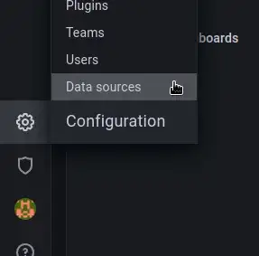
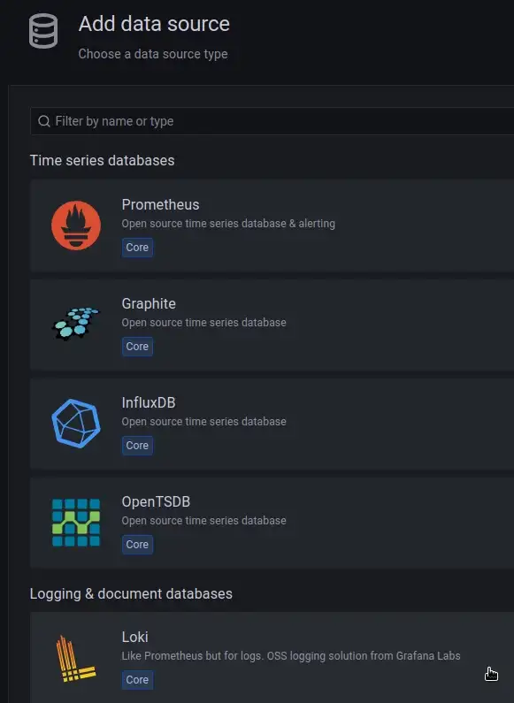
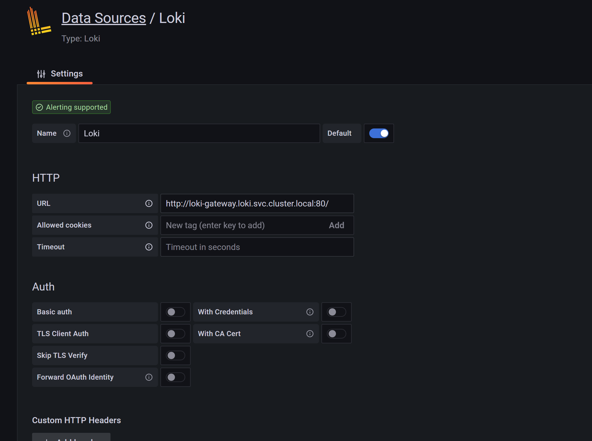
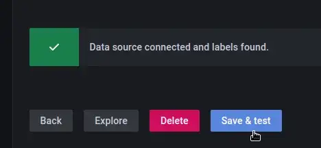
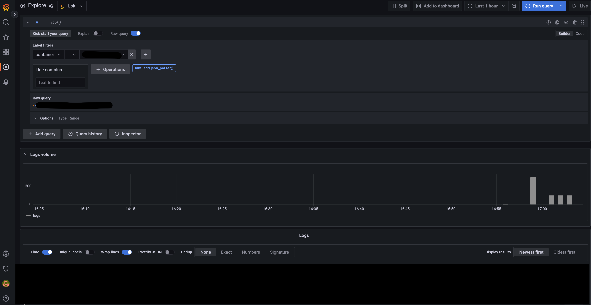

# Installation of Loki in AWS kubernetes cluster

## Pre-requisities
- EKS cluster on AWS

## Creating S3 bucket
Create a bucket named ``poc-loki-s3`` or something similar

## Creating a new IAM policy for EKS to access S3
```json
{
    "Version": "2012-10-17",
    "Statement": [
        {
            "Sid": "VisualEditor0",
            "Effect": "Allow",
            "Action": [
                "s3:PutObject",
                "s3:GetObject",
                "s3:ListBucket",
                "s3:DeleteObject"
            ],
            "Resource": ["arn:aws:s3:::poc-loki-s3",
                        "arn:aws:s3:::poc-loki-s3/*"
                        ]
        }
    ]
}
```
## Creating a new IAM roles for EKS to access S3
Go to EKS, find the OpenID Connect provider URL of your cluster

Go to IAM > Identity providers, find the OIDC ARN by the ID

Go to Roles, create a role: select the Web identity type, select our Identity provider from the list, and specify sts.amazon.com in Audience

Connect the previously created policy _poc-loki-s3_

Check the Trusted Policy, and save the new role
Save the ARN of the role — we will use it later in the Loki values.yaml file 

[,yaml]
----
include::values.yaml[tags=serviceaccount]
----

## Install Loki using helm chart in EKS
Add chart repository to helm

```bash
helm repo add grafana https://grafana.github.io/helm-charts
```

## Update the chart
```bash
helm repo update
```

## Deploy loki  to one EKS cluster
```bash
helm upgrade --install loki grafana/loki --create-namespace --namespace loki -f values.yaml
```

## Deploy promtail and target loki gateway
```bash
helm upgrade --install --namespace loki --set loki.serviceName=loki-gateway promtail grafana/promtail
```

## Configure grafana to have loki as datasource
Open http://localhost:3000 in a browser ( grafana should be launched ), log in, and go to Configuration — Data Sources :



Click on add datasource, choose Loki on the list



Add Loki as name and specify http://loki-gateway.loki.svc.cluster.local:80/ in the URL



Save and test , you should have a similar text 



## Look at logs

Go to Explore, select Loki from the top, and check the logs by doing a query. Click on query button:



