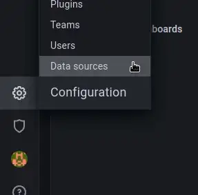
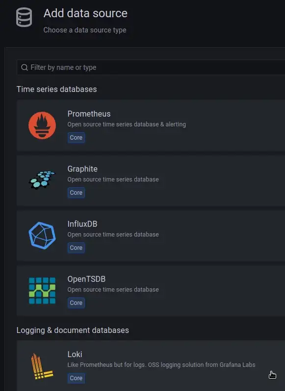
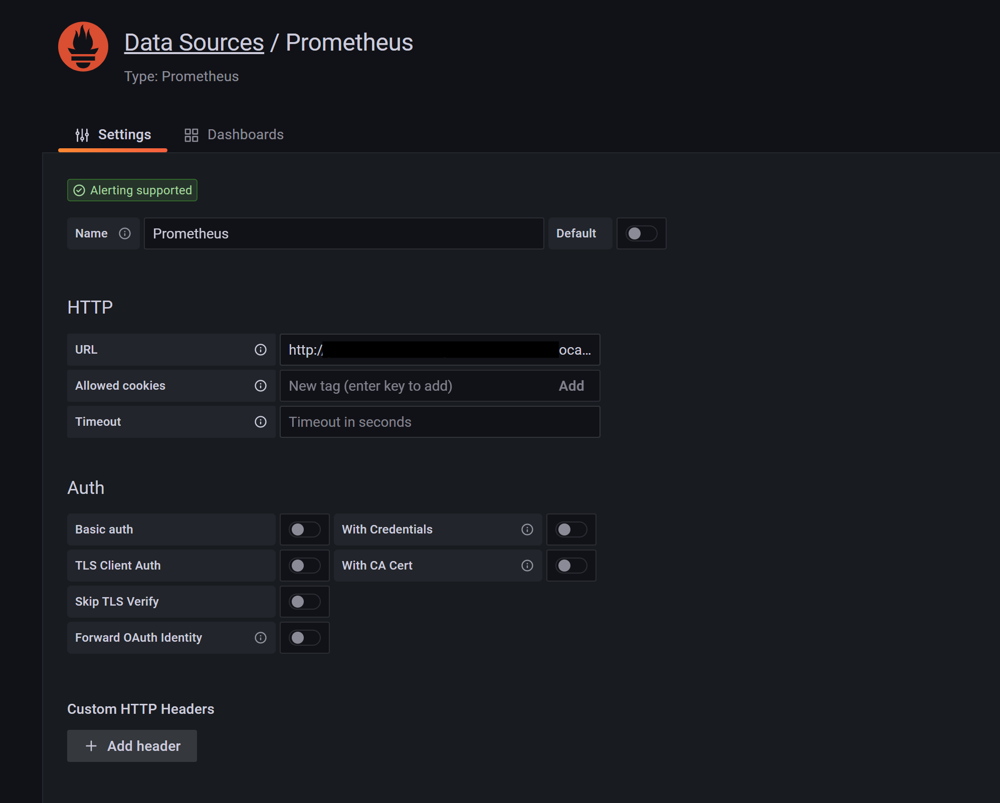
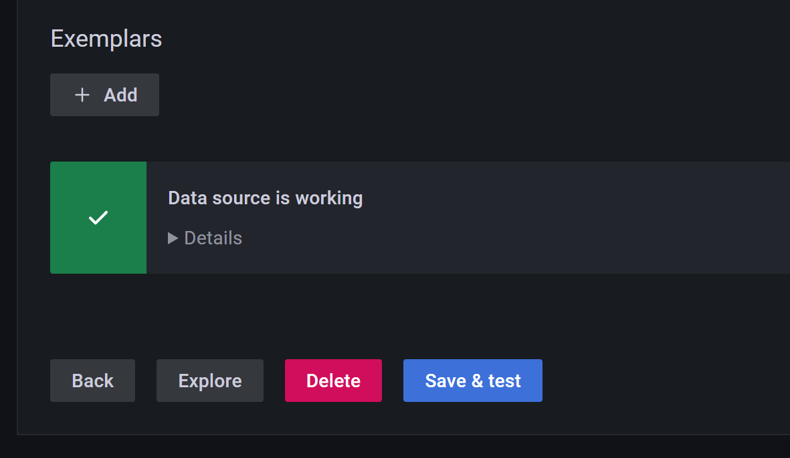

## Configure grafana to have Prometheus as datasource
Open http://localhost:3000 in a browser, log in, and go to Configuration — Data Sources :



Click on add datasource, choose Prometheus on the list



Add Prometheus as name and specify http://prometheus.loki.svc.cluster.local:9090/ in the URL



Save and test , you should have a similar text 



## Look at Metrics

Go to Explore, select Loki from the top, and check the logs by doing a query. Click on query button:


## Uninstall prometheus
```bash
helm uninstall prometheus -n loki
```